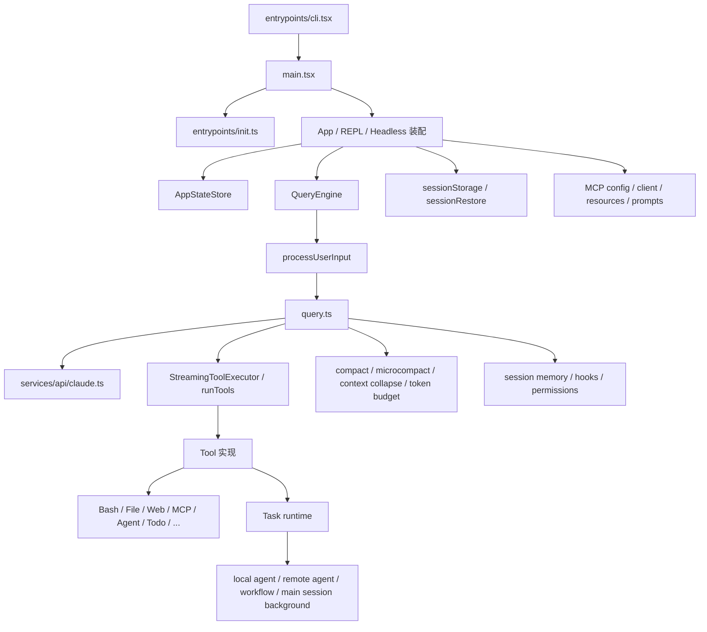

# Claude Code `src` 源码深度分析

## 0. 文档目标

这份文档不是“按目录扫一遍文件名”，而是试图回答下面几个更重要的问题：

- Claude Code 到底是一个什么系统
- 它从命令行启动之后，真正的主链路是什么
- 为什么它能把“终端里的大模型”做成一个长期可运行、可恢复、可治理的 Agent runtime
- 它的 Agent、Tool、Task、MCP、压缩、权限、恢复分别是怎么协同工作的
- 如果要复刻这套架构，最值得学的是什么

我这次重点研读过的核心源码包括：

- `claude-code/src/entrypoints/cli.tsx`
- `claude-code/src/main.tsx`
- `claude-code/src/entrypoints/init.ts`
- `claude-code/src/QueryEngine.ts`
- `claude-code/src/query.ts`
- `claude-code/src/query/config.ts`
- `claude-code/src/query/deps.ts`
- `claude-code/src/Tool.ts`
- `claude-code/src/tools.ts`
- `claude-code/src/services/tools/*`
- `claude-code/src/Task.ts`
- `claude-code/src/tasks/*`
- `claude-code/src/tools/AgentTool/*`
- `claude-code/src/utils/forkedAgent.ts`
- `claude-code/src/constants/prompts.ts`
- `claude-code/src/utils/api.ts`
- `claude-code/src/services/api/claude.ts`
- `claude-code/src/services/compact/*`
- `claude-code/src/services/SessionMemory/sessionMemory.ts`
- `claude-code/src/services/mcp/*`
- `claude-code/src/state/AppStateStore.ts`
- `claude-code/src/utils/sessionStorage.ts`
- `claude-code/src/utils/sessionRestore.ts`
- `claude-code/src/utils/permissions/*`

结论也都尽量建立在这些实现之上，而不是只看 README 或表层调用关系。

---

## 1. 一句话结论

Claude Code 的本质不是“LLM 调几个工具”，而是一套终端原生的 Agent 操作运行时。

它的主干可以概括成：

- `entrypoints/cli.tsx`：极薄的启动分流器
- `main.tsx` + `entrypoints/init.ts`：系统装配与基础设施预热
- `QueryEngine.ts`：会话级控制器
- `query.ts`：真正的单轮 Agent 主循环
- `Tool.ts` + `services/tools/*`：工具协议、权限、并发、hook、执行编排
- `Task.ts` + `tasks/*`：后台任务与长生命周期执行
- `AgentTool/*` + `utils/forkedAgent.ts`：多代理、子代理、隔离、共享、fork cache
- `services/api/claude.ts`：模型协议适配、流式事件、缓存策略、fallback
- `services/compact/*` + `SessionMemory/*`：长上下文治理
- `services/mcp/*`：MCP 连接、配置、认证、资源/提示词/工具桥接
- `sessionStorage.ts` + `sessionRestore.ts`：transcript、resume、sidechain、恢复

真正厉害的地方，不是它“能起子代理”，而是它把下面这些能力都做成了系统能力：

- 权限治理
- 工具并发调度
- 长上下文压缩
- prompt cache 稳定性
- transcript 持久化
- 后台任务与恢复
- data-driven agent 定义
- MCP 作为一等扩展面

这就是它和很多 demo 级 agent 的根本差别。

---

## 2. 先建立整体心智模型

如果只看表面，Claude Code 很容易被误解成：

1. 读用户输入
2. 拼一个 prompt
3. 把工具 schema 传给模型
4. 遇到 `tool_use` 就执行
5. 把 `tool_result` 回传给模型

这当然没错，但只描述了最表层。

从源码看，更准确的模型是：

> Claude Code = 会话控制器 + 统一 query 内核 + 工具运行时 + 任务运行时 + Agent 隔离机制 + 长上下文治理 + 权限治理 + transcript / resume 系统 + MCP 扩展层

换句话说，模型调用只是这套系统里的一环，不是全部。

---

## 3. 总体分层架构

这张图最重要的不是“模块很多”，而是三条主线：

- 交互主线：CLI / REPL / SDK 如何进入 query runtime
- 执行主线：query 如何驱动模型、工具、继续推理
- 生命周期主线：权限、上下文、任务、恢复、MCP 如何持续围绕它工作

---

## 4. 启动链路：它不是简单地 `main() -> run()`

### 4.1 `entrypoints/cli.tsx` 是一个极薄的 bootloader

这个文件最明显的特点，是非常克制。

它并不一上来就 import 整个应用，而是先做“轻量分流”：

- `--version`
- `--dump-system-prompt`
- MCP host / computer-use host 等内部模式
- `--daemon-worker`
- `remote-control | rc | remote | sync | bridge`
- `daemon`
- background session 相关命令
- template 相关命令

设计意图很清晰：

- 尽可能缩短冷启动路径
- 让不同运行模式在最外层就完成分叉
- 通过 `feature('...')` 做 dead-code elimination

这一步已经能看出 Claude Code 的一个重要风格：

> 它不是把 CLI 当脚本入口，而是把 CLI 当产品启动器。

### 4.2 `main.tsx` 是真正的 composition root

`main.tsx` 才是整个系统真正开始“装机”的地方。它负责：

- 读取命令行参数和环境
- 调用 `init()` 做基础设施初始化
- 组装 settings / auth / policy / analytics / model / MCP / plugin / agent / command / tool
- 构造 AppState
- 决定进入 interactive、print、headless、remote 等哪条路径

这里很像大型服务的 composition root，而不是普通 CLI 的业务入口。

### 4.3 `entrypoints/init.ts` 处理的不是业务，而是“可信启动”

这个文件说明 Claude Code 对启动阶段非常认真。它负责的内容包括：

- `enableConfigs()`：开启配置系统
- `applySafeConfigEnvironmentVariables()`：在信任边界内应用安全环境变量
- CA 证书、代理、mTLS
- graceful shutdown 注册
- 远程 managed settings / policy limits 的异步加载
- OAuth 账户信息预取
- API preconnect
- LSP / scratchpad / shell 初始化

这不是“程序开始前顺手做点设置”，而是在定义：

- 什么可以在系统完全信任前做
- 什么必须尽早加载
- 什么可以后台预热

这一层把 Claude Code 拉到了“终端 runtime”而不是“单命令工具”的级别。

---

## 5. UI 状态层：Claude Code 并不是“模型驱动一切”

### 5.1 `state/AppStateStore.ts` 说明 UI 是一等公民

这个文件很关键，因为它揭示了 Claude Code 的真实产品边界。

`AppState` 里管理的不只是“当前消息”这种基础数据，还包括：

- 设置、model、effort、verbose、status line
- `toolPermissionContext`
- tasks、foregrounded task、agent name registry
- MCP client/tool/resource/command 状态
- plugin 状态
- agent definitions
- file history、attribution、todos
- notifications、elicitation queue
- remote / bridge / daemon 连接状态
- speculation、footer selection、thinking 状态

这说明它不是“UI 只是 query.ts 的展示层”，而是：

> UI 自己就是运行时的一部分。

### 5.2 这层状态为什么重要

如果没有这个状态层，很多能力都会变得很难做：

- 工具执行中的权限提示与取消
- 背景任务可见化
- 子代理面板与前后台切换
- REPL 内 command / tool / task / bridge / MCP 的同屏协作
- resume 后的状态恢复

所以 Claude Code 的架构不是“model-first”，而是“runtime-first”。

---

## 6. `QueryEngine.ts`：会话级控制器

`QueryEngine` 的注释写得很直接：一个会话对应一个 `QueryEngine`。

它解决的是“conversation”这个层级的问题，而不是单次采样。

### 6.1 它维护哪些会话级状态

从源码看，`QueryEngine` 自己持有：

- `mutableMessages`
- `abortController`
- `permissionDenials`
- `totalUsage`
- `readFileState`
- `discoveredSkillNames`
- `loadedNestedMemoryPaths`

这些状态跨 turn 持续存在。

### 6.2 `submitMessage()` 做了哪些关键工作

`submitMessage()` 并不是“把用户消息塞给 query.ts”。它做了很多会话级 orchestration：

1. 设置 cwd 与 turn 级环境
2. 包一层 `canUseTool`，追踪 permission denial
3. 通过 `fetchSystemPromptParts()` 取 system prompt 片段
4. 通过 `processUserInput()` 处理 slash command、附件、hook、特殊输入
5. 构建 `ToolUseContext`
6. 发 SDK init / status / replay 事件
7. 调用 `query()` 进入真正主循环
8. 维护 transcript、usage、恢复状态和最终结果

因此更准确地说：

- `QueryEngine` 处理“会话怎么组织”
- `query.ts` 处理“这一轮怎么执行”

### 6.3 为什么这层必要

如果没有 `QueryEngine`，那 Claude Code 很难同时支持：

- REPL
- headless / SDK
- replay / includePartialMessages
- resume
- 持久化 usage 和 denial tracking

这层是“产品接口层”和“执行内核层”之间的缓冲层。

---

## 7. `processUserInput()`：输入不是字符串，而是一条小型管线

`utils/processUserInput/processUserInput.ts` 的存在非常说明问题。

它把用户输入变成一个可执行前置阶段，处理内容包括：

- slash command 解析
- 图片与附件
- `user-prompt-submit` hooks
- 桥接模式下的特殊输入
- meta/system 生成消息
- command 直接返回的结果
- command 对工具可用性的限制

这意味着在 Claude Code 里，用户输入不是“文本 prompt”，而是：

> 一份可能改变本轮执行参数、上下文、可用工具、消息序列的指令入口。

这也是为什么它能在同一个 UI 里把命令、提示词、附件、hooks、tool gating 统一起来。

---

## 8. `query.ts`：真正的 Agent 主循环

如果说整个系统只能选一个“最核心文件”，那就是 `query.ts`。

### 8.1 这不是一个简单的 ReAct loop

它当然有“模型 -> tool_use -> tool_result -> 再问模型”的结构，但源码里多出来的那一大圈才是关键：

- auto compact
- microcompact
- snip compact
- context collapse
- token budget
- stop hooks
- tool result budget
- streaming tool execution
- fallback model
- reactive compact
- synthetic error / tombstone / pairing repair

所以它更像一个“带上下文治理和恢复机制的 Agent state machine”。

### 8.2 `queryLoop()` 的状态设计

`queryLoop()` 内部维护了一个显式的 `State`：

- `messages`
- `toolUseContext`
- `maxOutputTokensOverride`
- `autoCompactTracking`
- `stopHookActive`
- `maxOutputTokensRecoveryCount`
- `hasAttemptedReactiveCompact`
- `turnCount`
- `pendingToolUseSummary`
- `transition`

这说明作者已经不是在写“串流程”，而是在写一个可演进的状态机。

### 8.3 `buildQueryConfig()`：冻结运行期配置

`query/config.ts` 里把部分运行时值在 query 入口一次性 snapshot 下来，例如：

- `streamingToolExecution`
- `emitToolUseSummaries`
- `isAnt`
- `fastModeEnabled`

这背后的设计思想很重要：

- feature gate 保持 inline，方便 tree-shaking
- 会在 query 期间抖动的运行时值，入口就冻结，避免一轮执行中状态变化

这对于可测试性和 cache 稳定性都非常关键。

### 8.4 `query/deps.ts`：核心 loop 有意留了窄 DI 缝

`query()` 并没有把所有副作用写死，而是抽了一个很窄的 `deps`：

- `callModel`
- `microcompact`
- `autocompact`
- `uuid`

这不是重度 IoC，而是很节制的 DI。作用是：

- 核心循环更好测
- 不需要到处 `spyOn` 模块
- 又不至于把整个系统抽象得失控

这是一个很成熟的“只抽最值钱依赖”的做法。

### 8.5 单轮执行的真实流程

从代码顺序看，一轮 query 大致会经历这些阶段：

1. 启动 memory prefetch 与 skill discovery prefetch
2. 基于 compact boundary 裁出真正参与本轮的消息
3. 处理 tool result budget
4. 做 `snipCompactIfNeeded`
5. 做 `microcompact`
6. 做 `contextCollapse.applyCollapsesIfNeeded`
7. 计算完整 system prompt
8. 做 `autocompact`
9. 构造 `StreamingToolExecutor`
10. 决定当前运行模型
11. 判断是否触发 hard blocking limit
12. 调 `deps.callModel()` 流式采样
13. 收 assistant 消息、tool_use block、stream event
14. 边流式边执行工具，或流结束后执行工具
15. 处理 tool results、tool summaries、stop hooks
16. 判断是结束、继续、fallback、compact retry，还是报错退出

很多框架的“agent loop”只有第 12 到第 15 步；Claude Code 真正复杂的地方在前后两侧。

### 8.6 流式 fallback 的处理很成熟

`query.ts` 和 `services/api/claude.ts` 一起说明了一个重要细节：

- 流式请求失败后，系统会 tombstone 已经产生但不再可信的 assistant partial messages
- 丢弃上一轮 streaming executor 中未完成的工具结果
- 使用新的 executor 重新接上

这不是简单 retry，而是“把不再可用的中间产物从消息链里安全移除”，避免 thinking block、tool_use pairing、invalid signature 等问题。

这类细节正是生产级 agent 和 demo agent 的差距。

---

## 9. Prompt、缓存和 API 适配：这套系统把 prompt cache 当成架构约束

这部分是 Claude Code 非常值得学习的地方。

### 9.1 `constants/prompts.ts` 并不是一个 prompt 文件，而是 prompt builder

这个文件有几个关键信号：

- system prompt 不是一个长字符串，而是分段构造的数组
- 存在 `SYSTEM_PROMPT_DYNAMIC_BOUNDARY`
- 注释明确警告：不要随便移除或重排这个 boundary，否则会影响缓存逻辑

它拼进去的内容非常丰富，包括：

- 基础系统指令
- output style
- hook 说明
- MCP 指令
- language 指令
- 风险操作确认原则
- 代码编辑原则
- model-specific / ant-specific 后缀

设计上最重要的一点是：

> prompt 在这里不是“告诉模型怎么做事”的文字，而是一个有 cache policy 的结构化输入。

### 9.2 `utils/api.ts` 把系统 prompt 拆成 cache-aware blocks

`splitSysPromptPrefix()` 的逻辑很关键。

它会根据是否开启 global cache，以及是否找到了动态边界，把 system prompt 分成不同 block：

- attribution header
- CLI sysprompt prefix
- boundary 之前的 static 内容
- boundary 之后的 dynamic 内容

不同块会被赋予：

- `cacheScope = null`
- `cacheScope = 'org'`
- `cacheScope = 'global'`

这意味着 Claude Code 从 prompt 设计阶段就已经在做：

- 哪部分适合跨会话缓存
- 哪部分只适合同组织缓存
- 哪部分必须保持动态

### 9.3 `toolToAPISchema()` 也在围绕稳定性设计

`utils/api.ts` 中的 `toolToAPISchema()` 做了几件很重要的事：

- 对 tool schema 做 session-stable cache
- 将 `name + inputJSONSchema` 作为 cache key
- 只在 per-request overlay 阶段叠加 `defer_loading`、`cache_control`
- 避免修改 cached base schema

这代表 Claude Code 明确知道：工具数组本身也是 prompt cache 的一部分。

### 9.4 `services/api/claude.ts` 是协议适配层，不只是 HTTP client

这个文件职责非常重，远不只是“发 Anthropic 请求”。它负责：

- 组装 system blocks、messages、tool schemas
- prompt caching 开关与 cache ttl 策略
- 全局/组织级 cache scope
- fast mode、effort、thinking、advisor、task budget 等 API 参数
- streaming 与 non-streaming fallback
- normalize/repair message pairing
- media strip、tool search、connector/advisor/chrome 附加逻辑
- usage、cost、requestId、trace、logging

一个典型例子是：

- 当 global cache 开启且有非 deferred 的 MCP tools 时，系统会判定 system prompt 不能走 global cache，改成 tool-based cache 策略

这说明 Claude Code 对“缓存是否稳定”的理解已经深入到工具池与扩展层，而不是只停留在 prompt 文本。

### 9.5 它为什么这么在意 prompt cache

从整体实现可以看出，Claude Code 并不是把 cache 当优化项，而是把它当架构约束：

- system prompt 有 boundary
- tool pool 会排序
- fork subagent 会保存 cache-safe params
- content replacement state 会克隆
- header 会 latch，避免中途翻转造成 cache key 抖动

这是一个很重要的设计层次：

> 成本控制、延迟控制和长期可扩展性，在 Claude Code 里不是后期优化，而是早期架构设计的一部分。

---

## 10. 工具系统：`Tool` 不是函数，是一个完整协议

### 10.1 `Tool.ts` 抽象得非常完整

Claude Code 里的 `Tool` 远远不只是：

- 名字
- 描述
- 输入 schema
- 一个 `call()`

它还显式编码了很多运行时行为：

- `isReadOnly()`
- `isDestructive()`
- `isConcurrencySafe()`
- `interruptBehavior()`
- `checkPermissions()`
- `validateInput()`
- `renderToolUseMessage()`
- `renderToolResultMessage()`
- `getActivityDescription()`
- `preparePermissionMatcher()`

这意味着 Tool 本身已经内置了：

- 安全属性
- 并发属性
- UI 属性
- 权限匹配属性
- 中断语义

这是一个非常“runtime-oriented”的工具抽象。

### 10.2 `ToolUseContext` 是整个工具运行时总线

`ToolUseContext` 里挂着大量运行时信息：

- `getAppState` / `setAppState`
- `abortController`
- `messages`
- `options.tools`
- `agentId` / `agentType`
- `queryTracking`
- `requestPrompt`
- `contentReplacementState`
- `renderedSystemPrompt`
- `localDenialTracking`
- `mcp` 相关上下文

很多系统会把工具设计成“纯函数 + schema”；Claude Code 则是把工具放进一个完整运行时里执行。

### 10.3 `tools.ts` 是工具池装配中心

`getAllBaseTools()` 暴露了 Claude Code 内建工具的真实广度。它不是几个常见原语，而是一整套终端能力集合：

- Bash / PowerShell
- FileRead / FileWrite / FileEdit / Glob / Grep
- WebFetch / WebSearch
- TodoWrite
- AskUserQuestion
- SkillTool
- AgentTool
- REPLTool
- MCP resource / prompt / command 工具
- Browser / Chrome / LSP / config / plan / worktree / sleep / cron 等

更重要的是，`assembleToolPool()` 做了两件很值钱的事：

1. 把内建工具和 MCP 工具统一拼起来
2. 为了 prompt cache 稳定性，保持 built-ins 连续前缀，并分别排序后再去重

这不是小细节，这是把 tool pool 设计成了“稳定输入”。

### 10.4 `toolOrchestration.ts`：并发不是“Promise.all”这么简单

这里的策略是：

- 可并发、只读、安全的工具可以批量并发执行
- 非并发安全的工具串行执行
- 并发工具产生的 `contextModifier` 不立即乱序生效，而是先收集，再按工具原始顺序回放

这一点非常成熟，因为它同时兼顾了：

- 并发性能
- 上下文一致性
- 顺序可解释性

### 10.5 `StreamingToolExecutor.ts`：Claude Code 会在 assistant message 还没完全生成时就开始跑工具

这是 Claude Code 降低交互延迟的一个关键点。

它支持：

- 工具边 stream in 边入队
- 并发安全工具并行执行
- 非并发工具独占执行
- 结果按原始工具出现顺序吐回
- 进度消息即时输出
- 用户中断、同批 bash 失败、streaming fallback 时的 synthetic error

也就是说，它不是等 assistant 完整落地后再统一处理工具，而是把“采样”和“执行”管线化了。

这非常像真正的 runtime scheduler，而不是函数调用器。

### 10.6 `toolExecution.ts`：工具执行被包在完整生命周期里

单次工具调用时，Claude Code 还会做：

- analytics
- permission 决策
- hooks
- telemetry tracing
- 错误分类
- MCP auth 错误处理
- bash classifier 逻辑
- tool result 存储与内容替换

这说明工具调用在系统里是“受治理的动作”，不是直接 `tool.call()`。

---

## 11. 任务系统：为什么它要把 Tool 和 Task 分开

这是 Claude Code 最成熟的设计之一。

### 11.1 `Task.ts` 定义了长生命周期执行单元

`TaskType` 里已经能看出 Claude Code 把什么当作“任务”：

- `local_bash`
- `local_agent`
- `remote_agent`
- `in_process_teammate`
- `local_workflow`
- `monitor_mcp`
- `dream`

任务状态也非常明确：

- `pending`
- `running`
- `completed`
- `failed`
- `killed`

`TaskStateBase` 还统一携带：

- description
- outputFile
- outputOffset
- notified
- start/end time

### 11.2 为什么 Tool 和 Task 要分层

Tool 关注的是：

- 单次动作
- 结构化输入输出
- 权限决策
- 与模型回合的直接交互

Task 关注的是：

- 长生命周期
- 后台运行
- 可取消
- 可恢复
- 可通知
- 可轮询

如果把后台 agent、远程执行、长 bash 都直接塞进 Tool 层，系统很快就会失去：

- 可见性
- 可恢复性
- 可前后台切换能力

Claude Code 没走这条路，所以它能把“后台主会话”“后台子代理”“remote task”都做成统一 substrate。

### 11.3 `LocalMainSessionTask.ts` 特别能说明问题

这个文件做了一件很有代表性的事：

- 主线程会话本身也可以被 background 成一个任务

也就是说，在 Claude Code 的世界里：

- 主会话并不是神圣不可建模的特殊物
- 它和子代理一样，也可以进入 task runtime

这是非常系统化的设计。

---

## 12. Agent 系统：Claude Code 真正的核心竞争力

### 12.1 `AgentTool.tsx` 不是“再问一次模型”

`AgentTool` 的输入不只是一个 prompt，它实际上支持：

- `description`
- `prompt`
- `subagent_type`
- model override
- background
- `name`
- `team_name`
- `mode`
- `cwd`
- isolation

这说明在 Claude Code 里，spawn agent 不是提示词技巧，而是运行时行为。

### 12.2 `loadAgentsDir.ts`：Agent 定义是数据驱动的

这个文件是理解 Claude Code agent 体系的关键之一。

Agent 不只是 prompt，还可以在 frontmatter / JSON 里定义：

- `tools`
- `disallowedTools`
- `skills`
- `mcpServers`
- `hooks`
- `model`
- `effort`
- `permissionMode`
- `maxTurns`
- `initialPrompt`
- `memory`
- `background`
- `isolation`
- `requiredMcpServers`
- `omitClaudeMd`

来源也不是单一的，而是多层叠加：

- built-in
- plugin
- user settings
- project settings
- policy settings
- flag settings

所以 Claude Code 的 agent 体系本质上是：

> 统一运行时 + 数据驱动角色配置

### 12.3 内建 agent 体现了“统一内核，多种 profile”

从 `builtInAgents.ts` 和几个 built-in agent prompt 可以看出：

- `general-purpose`：通用执行 agent
- `Explore`：只读、快速搜索专家
- `Plan`：只读、架构规划专家
- `verification`：对抗式验证 agent，强制命令证据与 verdict

这些 agent 并没有各写一套 runtime，而是：

- 改 prompt
- 改 tool whitelist / blacklist
- 改 model / background / omitClaudeMd 等策略

这是很成熟的 specialization 方式。

### 12.4 `runAgent.ts`：子代理复用的是同一套 query 内核

`runAgent.ts` 负责：

- agent-specific MCP 初始化
- 子代理 transcript 子目录
- worktree / remote isolation
- hooks
- 专属 tool pool
- 子代理上下文构建
- 调 `query()`

这很关键，因为它证明 Claude Code 没有为主线程和子代理分别维护两套执行引擎。

它真正复用的是同一个 query kernel。

### 12.5 `forkSubagent.ts` + `utils/forkedAgent.ts`：这是整套系统最值钱的设计之一

这部分代码揭示了 Claude Code 对“fork agent”真正的理解。

`CacheSafeParams` 明确要求这些内容和父请求保持一致：

- `systemPrompt`
- `userContext`
- `systemContext`
- `toolUseContext`
- `forkContextMessages`

原因不是语义正确，而是：

> 需要尽可能共享父请求的 prompt cache。

`createSubagentContext()` 的设计尤其重要：

- 默认克隆 `readFileState`
- 默认新建 `nestedMemoryAttachmentTriggers`
- 默认新建 `loadedNestedMemoryPaths`
- 默认新建 `dynamicSkillDirTriggers`
- 默认新建 `discoveredSkillNames`
- 默认克隆 `contentReplacementState`
- 默认不共享 `setAppState`
- 默认不共享 UI callback
- 默认新建 child abort controller

只有少数能力才按需共享：

- `shareAbortController`
- `shareSetAppState`
- `shareSetResponseLength`
- 自定义 `getAppState`

这是一套非常明确的哲学：

> 默认隔离，显式共享。

它既防止父子线程互相污染，又保留了 cache hit、权限衔接、局部协作的可能。

### 12.6 为什么 `contentReplacementState` 要克隆而不是重置

源码注释说得很直接：

- fork 子代理处理的是父消息里已经存在的 `tool_use_id`
- 如果用全新 replacement state，会做出和父线程不同的替换决策
- 请求字节不同，就会 cache miss

这是一种极少见但非常高水平的工程思维：

> 某些“看起来应该隔离”的状态，为了缓存一致性，必须克隆而不是重置。

---

## 13. 长上下文治理：Claude Code 的核心不是“大上下文”，而是“上下文管理系统”

Claude Code 并没有把“上下文无限”交给模型本身，而是做了一整套多层治理。

### 13.1 `autoCompact.ts`

它会基于 context window 和保留摘要输出空间，决定：

- warning 阈值
- error 阈值
- autocompact 触发阈值

还处理：

- 连续失败熔断
- querySource 级绕过
- 与 reactive compact / session memory / collapse 的协同

### 13.2 `compact.ts`

这不是简单总结老消息，而是：

- 先清理图片、文档等重内容
- 处理附件与 hook 结果
- 用严格格式生成 summary
- 再构建 post-compact messages
- 把必要的后置上下文重新补回

它做的是一次受控的“上下文形态转换”，不是文本摘要。

### 13.3 `microCompact.ts`

这是更细粒度的策略，用来压缩高体积工具结果，例如：

- file read / write / edit
- shell
- grep / glob
- web fetch / search

它和 full compact 的层次不一样：

- full compact 是会话级重组
- microcompact 是局部结果瘦身

### 13.4 `context collapse`

从 `query.ts` 注释能看出，collapse 采用的是一种投影视图思路：

- REPL 原始历史并不一定直接删掉
- collapsed view 在读时重建
- commit log 驱动后续 turn 的投影

这比简单地“删老消息”更适合 UI 和 resume 共存。

### 13.5 `tokenBudget.ts`

这又是另外一层：

- 不是上下文压缩
- 而是 agent 层面的 token budget auto-continue

也就是说 Claude Code 把这些概念分得很清楚：

- context window 管理
- task budget
- output token recovery
- auto-continue

这体现出很强的 runtime discipline。

### 13.6 `SessionMemory/sessionMemory.ts`

session memory 更说明 Claude Code 的成熟度。

它不是把 memory 做成主线程里每 turn 一定执行的步骤，而是：

- 根据 token 增长和工具调用阈值决定是否抽取
- 在后台用 forked agent 去做
- 用 `createCacheSafeParams()` + `createSubagentContext()` 保持父线程稳定
- 写到 markdown 记忆文件

这等于说 Claude Code 认为：

> memory extraction 本身也是一个 agent 任务，而不是主循环里硬编码的一段逻辑。

---

## 14. 持久化与恢复：这是 Claude Code 区别于 demo agent 的另一条分水岭

### 14.1 `sessionStorage.ts`：transcript 不是日志，而是恢复基座

这个文件处理了很多很细的持久化问题：

- transcript JSONL 路径与 projectDir 计算
- transcript message 与非 transcript entry 的区分
- parentUuid 链参与者筛选
- progress entry 的桥接兼容
- 大 transcript 的读取上限与 tail/head 优化
- agent sidechain transcript 子目录
- content replacement 记录
- worktree / branch / mode / metadata 保存

一个非常值得注意的设计是：

- `progress` 被明确视为非 transcript message
- 因为把它混进 parentUuid 链会破坏 resume 时真正消息链的连续性

这就是典型的“系统写久了才会补出来”的工程细节。

### 14.2 `sessionRestore.ts`：恢复的不是消息数组，而是整个会话状态

它负责恢复：

- file history
- attribution
- context collapse 状态
- todos
- agent setting
- model override
- worktree state

也就是说，resume 在 Claude Code 里不是“把旧消息加载回来”，而是：

> 尽可能恢复一个可继续运行的会话现场。

### 14.3 sidechain transcript 很重要

子代理、后台任务、fork agent 并不是都混在主 transcript 里。

Claude Code 通过 sidechain transcript 做到了：

- 主线程链路保持干净
- 子代理保留独立可追踪轨迹
- resume 时可以有选择地恢复
- task / agent / summary 各自留痕

这对多 agent 系统极其重要。

---

## 15. 权限系统：不是“允许/拒绝”，而是一套治理引擎

### 15.1 `permissionSetup.ts` 和 `permissions.ts` 说明它是 mode-aware 的

Claude Code 的权限不是简单 ACL，而是和 mode、settings source、tool 特性一起工作的：

- `plan`
- `acceptEdits`
- auto mode
- user/session/cli/command 来源的规则
- MCP server 级匹配
- wildcard rule

而且权限判定原因也是结构化的，例如：

- classifier
- hook
- rule
- mode
- subcommand
- prompt-tool

### 15.2 权限系统不只做判定，还做交互与追踪

它还负责：

- 生成用户可理解的 permission request 文案
- 处理 denial tracking
- 驱动 shouldAvoidPermissionPrompts 等行为
- 支撑 analytics

也就是说，在 Claude Code 里：

> 权限不是工具外层的一道 if，而是一个贯穿工具执行、UI、Agent mode 的治理系统。

---

## 16. MCP：Claude Code 把它当成一等扩展面

### 16.1 `services/mcp/types.ts` 显示 MCP 的 transport 与 scope 很完整

支持的 transport 包括：

- `stdio`
- `sse`
- `sse-ide`
- `http`
- `ws`
- `sdk`
- `claudeai-proxy`

配置来源还区分：

- local
- user
- project
- dynamic
- enterprise
- claudeai
- managed

这已经不是“连个 MCP server”这么简单了，而是企业级配置层。

### 16.2 `services/mcp/config.ts` 负责多来源合并和原子写入

它处理：

- `.mcp.json` 的原子写入
- 多 scope 合并
- plugin MCP 服务器按配置签名去重
- enterprise / managed / proxy 逻辑

### 16.3 `services/mcp/client.ts` 是重量级子系统

它已经覆盖了很多真正落地才会遇到的问题：

- 多 transport 客户端
- OAuth / auth / XAA
- result truncation
- image downsampling
- session expiry 与 reconnect
- MCP auth tool
- resource / prompt 列举
- telemetry

所以 Claude Code 不是“支持 MCP”，而是“把 MCP 做进了自己的运行时模型”。

---

## 17. 这套系统最值得学习的设计思想

读完源码后，我认为 Claude Code 最重要的设计思想有 8 个。

### 17.1 统一执行内核

主线程、子代理、fork agent、session memory，本质上都复用同一个 `query()`。

好处是：

- 一套 compact / fallback / stop hook / tool repair
- 行为一致
- 新能力只要接一次

### 17.2 Tool 和 Task 分层

这个分层直接决定系统能不能长期演进。

### 17.3 默认隔离，显式共享

`createSubagentContext()` 是这条原则最好的体现。

### 17.4 prompt cache 稳定性是架构约束

这不是性能优化，而是设计前提。

### 17.5 配置与角色数据驱动

Agent、MCP、plugin、settings、policy 都不是硬编码在流程里的。

### 17.6 长上下文治理不是一个功能，而是一组协同策略

- snip
- microcompact
- autoCompact
- reactiveCompact
- collapse
- session memory

### 17.7 transcript 是运行时基座

没有 transcript / sidechain / restore，就不会有可恢复的 agent runtime。

### 17.8 权限与治理内置在内核

Claude Code 没有把安全放到最外层，而是把它做进了 tool runtime 和 agent mode。

---

## 18. 如果要复刻 Claude Code，真正该抄什么

如果只是想做一个能跑的 agent，Claude Code 里很多东西可以暂时不做。

但如果想做一个“能长期使用、能扩展、能治理”的版本，我认为最该抄的是这些：

### 第一层：最小可复用内核

- `QueryEngine` 与 `query()` 的分层
- `Tool` 协议而不是工具函数列表
- Tool 与 Task 分层
- transcript 持久化

### 第二层：真正拉开差距的能力

- `createSubagentContext()` 这套隔离/共享机制
- prompt cache 稳定性设计
- tool pool 稳定排序
- compact / microcompact / reactive compact 协同

### 第三层：把系统做成产品

- MCP 子系统
- permission / hook / policy
- background task / remote agent / resume
- AppState 与 REPL 的状态化 UI

---

## 19. 推荐的源码阅读顺序

如果之后还要继续深入，我建议按这个顺序读：

1. `src/entrypoints/cli.tsx`
2. `src/main.tsx`
3. `src/QueryEngine.ts`
4. `src/query.ts`
5. `src/Tool.ts`
6. `src/tools.ts`
7. `src/services/tools/toolOrchestration.ts`
8. `src/services/tools/StreamingToolExecutor.ts`
9. `src/tools/AgentTool/AgentTool.tsx`
10. `src/tools/AgentTool/runAgent.ts`
11. `src/utils/forkedAgent.ts`
12. `src/constants/prompts.ts`
13. `src/utils/api.ts`
14. `src/services/api/claude.ts`
15. `src/services/compact/*`
16. `src/utils/sessionStorage.ts`
17. `src/utils/sessionRestore.ts`
18. `src/services/mcp/*`

这样读，会比较容易先建立“主干”，再理解“为什么会有这些复杂配套层”。

---

## 20. 最后的判断

Claude Code 的源码最值得尊敬的地方，不是它堆了很多功能，而是它做出了一个很完整的运行时边界：

- 模型调用是一个子问题
- 工具调用是一个子问题
- Agent 只是运行时里的一类执行单元
- 真正的主角是那套负责治理上下文、权限、任务、缓存、恢复、扩展的系统

所以如果用一句更准确的话来描述它：

> Claude Code 不是“带工具的大模型 CLI”，而是一套以终端为宿主、以 query 内核为中心、以 Tool/Task/Agent/MCP 为执行单元的 Agent runtime。

这也是为什么它的源码值得深入读，而不只是“学几段 prompt 和 function calling”。
