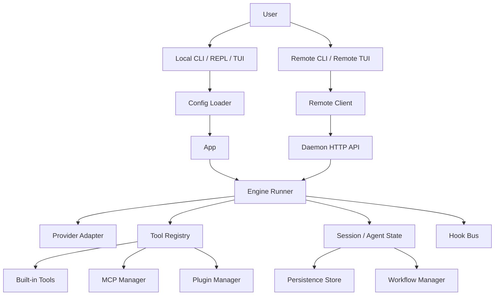
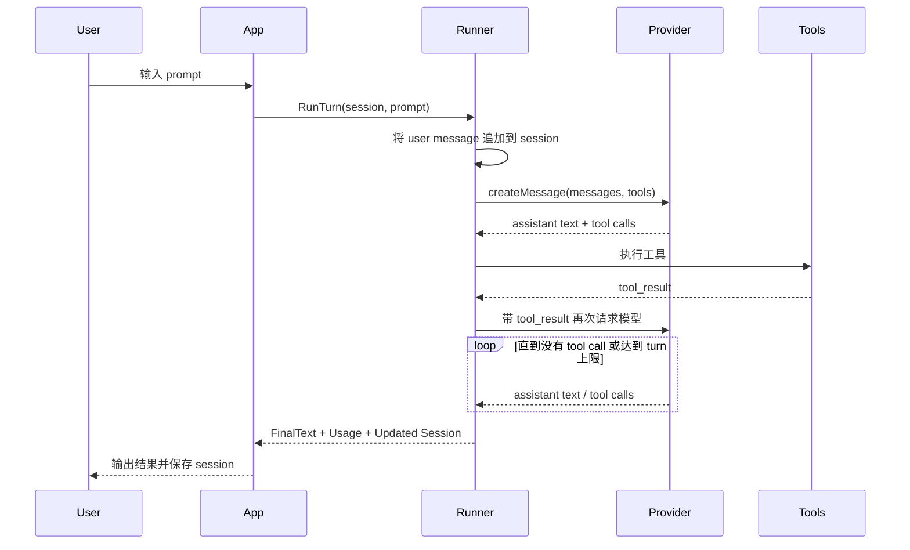

# xxx-code

`xxx-code` 是一个用 Go 实现的终端原生 coding agent runtime。

它受 Claude Code 的产品思路启发，但目标不是逐层复刻前端交互，而是把最关键的能力做成一个稳定、可部署、可扩展的系统内核：

- 本地 CLI / REPL / TUI
- 多轮 agent 推理与工具调用
- multi-agent 与 workflow 编排
- MCP 与插件扩展
- daemon / remote bridge / remote TUI
- 权限、审计、恢复、流式输出、配置治理

如果你想要的是一个“能在终端里直接干活”的 Go 版 agent，并且后续还要把它当成多 agent 平台、守护进程或者自动化基础设施继续演进，`xxx-code` 就是为这个方向设计的。

## 它是什么

从定位上看，`xxx-code` 不是一个简单的“调用模型 API 的 CLI”，而是一个完整的 agent runtime：

- 它会维护会话 transcript，而不是只做单轮问答
- 它会把工具注册成统一的 registry，让模型通过 tool calling 驱动系统
- 它支持子 agent、workflow、恢复、排队、优先级、重试、超时、资源配额
- 它支持把 MCP server、命令型插件、hooks、daemon API 都收进同一套运行时边界里
- 它既能本地跑，也能作为远程 daemon 持续运行，再由 remote bridge 或 remote TUI 连接

一句话总结：

> `xxx-code` 是“终端交互 + agent runtime + orchestration + remote runtime”四层合一的 Go 项目。

## 它能做什么

`xxx-code` 适合的事情很多，但最典型的是这几类：

1. 代码库理解与分析  
   例如让它扫描项目结构、梳理模块关系、解释某条调用链、定位某个错误的根因。

2. 小到中等规模的编码任务  
   例如改一个接口、补一个 CLI 参数、修一个测试、增加一个 provider、补一个 daemon API。

3. 多步骤自动化  
   例如“先搜索代码，再生成修改方案，再改代码，再跑测试，再汇总结果”。

4. 多 agent 并行分解任务  
   例如把“梳理前端、后端、部署、测试”拆成多个 agent 并发推进，再在主会话里汇总结果。

5. 长时运行的远程代理  
   例如把它跑成 daemon，团队里的本地 CLI/TUI 再去连这个远程实例。

6. 外部能力接入  
   例如通过 MCP 接入浏览器、数据库、文档系统；通过插件接入内部工具；通过 hooks 发事件。

7. 可审计的 agent 平台能力  
   例如记录请求、权限阻止、agent 生命周期、workflow 状态和 daemon 审计日志。

## 核心功能总览

### 交互层

- 本地 REPL
- 本地 TUI
- 单次执行 `--print`
- daemon 模式
- remote bridge
- remote TUI

### 模型与推理层

- 多轮 tool-calling agent loop
- 流式文本输出
- 自动上下文压缩
- provider 抽象
- 多 provider 支持：
  - `anthropic`
  - `openai`
  - `gpt`（`openai` 别名）
  - `azure-openai`
  - `gemini`
  - `minimax`
  - `glm`

### 工具与执行层

- 内建文件工具：
  - `read_file`
  - `write_file`
  - `edit_file`
  - `glob`
  - `grep`
- Shell 工具：
  - `bash`
- agent 工具：
  - `agent_spawn`
  - `agent_fanout`
  - `agent_send`
  - `agent_wait`
  - `agent_cancel`
  - `agent_list`
- workflow 工具：
  - `workflow_list`
  - `workflow_get`
  - `workflow_tasks`
  - `workflow_resume`

### orchestration 层

- 子 agent 隔离运行
- 最大并发 agent 数限制
- agent 优先级与排队
- fanout workflow
- `depends_on` 依赖图
- prompt 引用上游结果
- `retries`
- `timeout_seconds`
- `fail_fast`
- `resource` / `resource_limits`
- `preempt_lower_priority`
- workflow artifact 输出
- workflow resume

### 扩展层

- MCP client 与动态 tool bridge
- 支持 `stdio / http / sse / ws`
- MCP health / reload / validate
- MCP resources / prompts / resource templates
- 插件目录与 manifest
- 命令型插件桥接为动态工具
- 插件 validate / install / remove / reload
- hooks shell command
- hooks JSONL event sink

### 持久化与治理

- 主会话 transcript 持久化
- agent 状态持久化
- workflow 状态持久化
- daemon session 持久化
- `--resume`
- 权限策略
- daemon bearer auth
- token file 热轮换
- daemon ACL
- daemon 审计日志
- per-client rate limit
- `--log-level / --debug / --log-file`

## 架构总览

### 总体组件图



### 一次 turn 的执行流



## 关键设计思路

`xxx-code` 的实现有几条很核心的设计原则，这些原则基本决定了今天的代码结构。

### 1. 交互面和运行时分离

本地 CLI、TUI、daemon、remote bridge 看起来像是不同产品形态，但底层尽量复用同一个 runtime。

这带来的好处是：

- 本地模式和远程模式行为更一致
- 工具、权限、workflow、resume 不会出现两套逻辑
- 新能力通常只需要接入一次 engine，而不是每个入口各做一遍

在代码里，这条主线大致是：

- `cmd/xxx-code/main.go`
- `internal/cli`
- `internal/remote`
- `internal/daemon`
- `internal/engine`

### 2. Session 是事实来源

`xxx-code` 不把“当前状态”散落在很多临时对象里，而是把消息 transcript 当作核心状态：

- 用户消息追加进 session
- assistant 输出追加进 session
- tool call / tool result 也进入 session
- 自动压缩发生时，session 仍是主状态对象
- persist / resume 最终也是围绕 session 展开

这种设计让“恢复”和“远程继续接着跑”更自然，因为系统总是能回到一个可序列化的会话状态。

### 3. Tool Registry 是统一扩展边界

无论是内建工具、MCP 动态工具还是插件动态工具，最终都收敛到同一套 `Tool` 接口：

```go
type Tool interface {
    Definition() ToolDefinition
    Call(ctx context.Context, exec *ExecutionContext, input json.RawMessage) (ToolResult, error)
}
```

这个抽象很重要，因为它让：

- provider 层只需要知道“有哪些工具”
- runner 只需要知道“怎么按名字找工具、执行工具”
- MCP / 插件都能被桥接成“一等工具”

所以 `xxx-code` 的扩展方式不是“再发明一套插件协议”，而是先把所有能力统一折叠到 tool registry。

### 4. multi-agent 不是另一个系统，而是 runner 的自然延伸

很多系统会把“agent”和“workflow”做成完全独立的编排引擎，`xxx-code` 则更偏向把它做成 runner 的延长线：

- 子 agent 仍然走同一套 provider + tool loop
- agent 生命周期仍然在同一个 engine 里管理
- workflow 只是对多个 agent 执行计划、依赖关系和状态快照的封装

这样做的好处是：

- agent 行为一致
- tooling 不需要重复实现
- session / workflow / artifact / persistence 更容易打通

### 5. 默认本地优先，但从一开始就预留远程运行能力

本地 CLI 是默认入口，但系统并没有把“本地”写死：

- session 可以持久化
- daemon 可以托管远程 session
- remote client 可以连 daemon
- remote TUI 可以把本地 UI 体验迁移到远端

也就是说，`xxx-code` 既适合个人机器上直接跑，也适合把 agent runtime 放到某台稳定机器上长期运行。

### 6. 安全不是事后补丁，而是 runtime 层能力

权限、审计、ACL、rate limit 这些东西不是简单堆在网关层，而是深度进入运行时：

- 读写路径受 `PermissionPolicy` 控制
- `bash` 支持前缀 allow / deny
- tool 级 allow / deny
- daemon 有 bearer token、ACL、audit、rate limit
- hooks 和 policy 阻止会留下结构化痕迹

这意味着 `xxx-code` 更像一个可治理的 agent runtime，而不只是本地玩具。

### 7. YAML-first 配置，便于长期维护

配置层采用：

- 默认值
- config file
- env
- flags

并且默认优先发现 `.xxx-code/config.yaml`。

这样做的原因很简单：

- YAML 更适合写注释
- 对长期维护的 agent 配置更友好
- 也更适合团队协作、示例模板和运维

## 目录结构

```text
xxx-code/
  cmd/xxx-code/              程序入口
  docs/                      补充部署文档
  examples/                  配置模板与 .env 示例
  internal/
    auth/                    token file 与鉴权辅助
    buildinfo/               版本与构建信息
    cli/                     本地 REPL / TUI
    config/                  flags / env / YAML / JSON 配置加载
    daemon/                  HTTP daemon、session API、审计、ACL
    diag/                    日志与 trace
    engine/                  runner、session、tool registry、agent state
    hooks/                   shell hooks 与 JSONL event bus
    integration/             端到端测试
    mcp/                     MCP 配置、连接、动态 tool bridge
    persist/                 session / agents / workflows 持久化
    plugins/                 插件 manifest、安装、桥接、管理
    provider/                provider 工厂与具体适配
    remote/                  daemon client、remote REPL / TUI
    tools/                   内建工具与 workflow 实现
  ROADMAP.md                 项目阶段计划
  README.md                  当前说明文档
```

## 运行模式

| 模式 | 入口 | 适合场景 |
| --- | --- | --- |
| 本地 REPL | `go run ./cmd/xxx-code` | 边聊边改代码 |
| 本地单次执行 | `go run ./cmd/xxx-code --print "..."` | 脚本化、一次性任务 |
| 本地 TUI | `go run ./cmd/xxx-code --tui` | 更连续的终端体验 |
| daemon | `go run ./cmd/xxx-code --daemon` | 持续运行的远程 agent runtime |
| remote REPL | `go run ./cmd/xxx-code --remote-url ...` | 连接远程 daemon |
| remote TUI | `go run ./cmd/xxx-code --remote-url ... --tui` | 远程会话的富交互界面 |

## 支持的 provider

| provider | 说明 | 关键环境变量 |
| --- | --- | --- |
| `anthropic` | 默认 provider，走 Anthropic Messages 风格适配 | `ANTHROPIC_API_KEY` |
| `openai` | OpenAI Chat Completions / OpenAI-compatible | `OPENAI_API_KEY` |
| `gpt` | `openai` 的别名 | `OPENAI_API_KEY` |
| `azure-openai` | Azure OpenAI，使用 API key 模式 | `AZURE_OPENAI_API_KEY`, `AZURE_OPENAI_BASE_URL` |
| `gemini` | 走 Gemini 的 OpenAI-compatible endpoint | `GEMINI_API_KEY` |
| `minimax` | 走 MiniMax 的 OpenAI-compatible endpoint | `MINIMAX_API_KEY` |
| `glm` | 走 GLM / BigModel / Zhipu 兼容入口 | `GLM_API_KEY` / `ZHIPUAI_API_KEY` / `BIGMODEL_API_KEY` / `ZAI_API_KEY` |

说明：

- 默认 provider 是 `anthropic`
- `remote` 客户端本地不需要 provider API key，provider 由 daemon 侧负责
- 兼容 provider 的目标是统一 runtime 行为，不是强行隐藏各家模型的差异

## 安装与运行

### 环境要求

- 如果你从源码运行或自行构建，需要 Go `1.25.0`
- 如果你直接使用 release 二进制，不需要本地安装 Go
- 本地直连 provider 时，需要一个可用的模型 API key
- 如果要用 TUI，需要终端支持基本的交互式能力

### 通过 GitHub Releases 安装二进制

发布产物会同时包含：

- `xxx-code`
- `xxx-code-stability`
- `docs/`
- `examples/`

发布页：

- [x-agent Releases](https://github.com/csonxx/x-agent/releases)

macOS / Linux 示例：

```bash
VERSION=v0.1.0
ARCHIVE="xxx-code_${VERSION#v}_darwin_arm64.tar.gz"

curl -LO "https://github.com/csonxx/x-agent/releases/download/${VERSION}/${ARCHIVE}"
curl -LO "https://github.com/csonxx/x-agent/releases/download/${VERSION}/checksums.txt"

grep " ${ARCHIVE}$" checksums.txt | shasum -a 256 -c
tar -xzf "${ARCHIVE}"

mkdir -p "${HOME}/.local/bin"
install -m 0755 ./xxx-code "${HOME}/.local/bin/xxx-code"
install -m 0755 ./xxx-code-stability "${HOME}/.local/bin/xxx-code-stability"

"${HOME}/.local/bin/xxx-code" --version
"${HOME}/.local/bin/xxx-code-stability" --version
```

如果你是 Linux `amd64`，把 `darwin_arm64` 换成 `linux_amd64`；如果是 Linux `arm64`，换成 `linux_arm64`。

Windows 示例：

```powershell
$version = "v0.1.0"
$archive = "xxx-code_$($version.TrimStart('v'))_windows_amd64.zip"

Invoke-WebRequest -Uri "https://github.com/csonxx/x-agent/releases/download/$version/$archive" -OutFile $archive
Expand-Archive -Path $archive -DestinationPath .\xxx-code-release

.\xxx-code-release\xxx-code.exe --version
.\xxx-code-release\xxx-code-stability.exe --version
```

### 直接运行

先进入项目目录：

```bash
cd /Users/tt/goworkspace/src/x-agent/xxx-code
```

设置 provider 所需的 key，例如默认 Anthropic：

```bash
export ANTHROPIC_API_KEY=your-key
```

启动本地 REPL：

```bash
go run ./cmd/xxx-code
```

### 编译成本地二进制

```bash
go build -o ./bin/xxx-code ./cmd/xxx-code
go build -o ./bin/xxx-code-stability ./cmd/xxx-code-stability
./bin/xxx-code --version
./bin/xxx-code-stability --version
```

### 查看版本

```bash
go run ./cmd/xxx-code --version
```

或者：

```bash
go run ./cmd/xxx-code version
```

## 快速开始

### 方式 1：最简单的本地交互

```bash
export ANTHROPIC_API_KEY=your-key
go run ./cmd/xxx-code
```

进入 REPL 后，你可以直接输入：

```text
分析当前仓库里 xxx-code 的配置系统是怎么实现的
```

### 方式 2：单次执行

适合脚本化场景：

```bash
go run ./cmd/xxx-code --print "分析当前目录的 Go 模块依赖关系"
```

也可以直接把 prompt 作为最后一个参数，程序会自动进入单次执行模式：

```bash
go run ./cmd/xxx-code "找出当前仓库里所有 daemon 相关入口"
```

### 方式 3：本地 TUI

```bash
go run ./cmd/xxx-code --tui
```

适合连续工作、长会话和流式输出观察。

### 方式 4：daemon + remote

先在一台机器上启动 daemon：

```bash
export ANTHROPIC_API_KEY=your-key
go run ./cmd/xxx-code --daemon --listen 127.0.0.1:7331
```

再在本地连接它：

```bash
go run ./cmd/xxx-code \
  --remote-url http://127.0.0.1:7331 \
  --remote-session demo
```

或者直接用 remote TUI：

```bash
go run ./cmd/xxx-code \
  --remote-url http://127.0.0.1:7331 \
  --remote-session demo \
  --tui
```

## 配置方式

### 配置优先级

优先级从低到高：

1. 内建默认值
2. 配置文件
3. 环境变量
4. CLI flags

### 默认自动发现的文件

`xxx-code` 会自动尝试发现：

- `.xxx-code/config.yaml`
- `.xxx-code/config.yml`
- `.xxx-code/config.json`

推荐使用 YAML。

### 推荐目录布局

```text
your-project/
  .xxx-code/
    config.yaml
    session.json
    daemon/
    artifacts/
    hooks/
    plugins/
```

### 示例模板

仓库里已经提供了完整模板：

- [examples/config.yaml](./examples/config.yaml)
- [examples/anthropic.yaml](./examples/anthropic.yaml)
- [examples/openai.yaml](./examples/openai.yaml)
- [examples/gpt.yaml](./examples/gpt.yaml)
- [examples/azure-openai.yaml](./examples/azure-openai.yaml)
- [examples/gemini.yaml](./examples/gemini.yaml)
- [examples/minimax.yaml](./examples/minimax.yaml)
- [examples/glm.yaml](./examples/glm.yaml)
- [examples/.env.example](./examples/.env.example)

### 一个最小可用配置

```yaml
provider: anthropic
model: claude-sonnet-4-5
cwd: .
session_file: .xxx-code/session.json
stream: true
allow_read:
  - .
allow_write:
  - .
log_level: info
```

### 常用配置项

| 字段 | 作用 |
| --- | --- |
| `provider` | 选择模型提供方 |
| `model` | 模型名或 deployment 名 |
| `cwd` | 工具和相对路径的工作目录 |
| `session_file` | 主会话持久化文件 |
| `mcp_config` | MCP 配置文件路径 |
| `plugin_dir` | 插件目录 |
| `stream` | 是否流式输出模型文本 |
| `max_turns` | 单次 prompt 最大 agent turn 数 |
| `max_tokens` | 单次模型请求最大输出 token |
| `context_budget` | 触发自动 compact 的近似上下文预算 |
| `compact_keep` | compact 时保留的最近消息数 |
| `max_parallel_agents` | 子 agent 最大并发数 |
| `allow_read` | 允许读取的根目录列表 |
| `allow_write` | 允许写入的根目录列表 |
| `allow_tools` | 工具 allowlist |
| `deny_tools` | 工具 denylist |
| `allow_bash_prefix` | 允许的 bash 命令前缀 |
| `deny_bash_prefix` | 拒绝的 bash 命令前缀 |
| `hook_before_tool` | 每次 tool call 前执行的 shell hook |
| `hook_after_tool` | 每次 tool call 后执行的 shell hook |
| `hook_after_turn` | 每次 turn 后执行的 shell hook |
| `hook_agent_event` | agent 生命周期事件 hook |
| `hook_event_file` | JSONL hooks 事件输出文件 |
| `log_level` | `error / info / debug` |
| `log_file` | 日志落盘位置 |

### 重要环境变量

通用：

- `XXX_CODE_PROVIDER`
- `XXX_CODE_API_KEY`
- `XXX_CODE_BASE_URL`
- `XXX_CODE_MODEL`
- `XXX_CODE_CONFIG`
- `XXX_CODE_LOG_LEVEL`
- `XXX_CODE_LOG_FILE`
- `XXX_CODE_MCP_CONFIG`
- `XXX_CODE_PLUGIN_DIR`
- `XXX_CODE_HOOK_EVENT_FILE`

provider 相关：

- `ANTHROPIC_API_KEY`
- `OPENAI_API_KEY`
- `AZURE_OPENAI_API_KEY`
- `AZURE_OPENAI_BASE_URL`
- `GEMINI_API_KEY`
- `MINIMAX_API_KEY`
- `GLM_API_KEY`
- `ZHIPUAI_API_KEY`
- `BIGMODEL_API_KEY`
- `ZAI_API_KEY`

daemon / remote 相关：

- `XXX_CODE_DAEMON_TOKEN`
- `XXX_CODE_DAEMON_TOKEN_FILE`
- `XXX_CODE_REMOTE_URL`
- `XXX_CODE_REMOTE_TOKEN`
- `XXX_CODE_REMOTE_TOKEN_FILE`
- `XXX_CODE_REMOTE_SESSION`
- `XXX_CODE_DAEMON_AUDIT_FILE`

## 内建工具与扩展工具

### 内建工具

内建工具主要分 4 类：

1. 文件工具  
   用来读写文件、搜索代码、做最基本的代码修改。

2. shell 工具  
   用来执行命令、跑测试、调用现有脚本。

3. agent 工具  
   用来启动、等待、继续、取消子 agent。

4. workflow 工具  
   用来处理 fanout workflow 的查询和恢复。

### MCP 动态工具

MCP server 连接后，远端暴露的 tool 会被桥接成：

```text
mcp__<server>__<tool>
```

同时系统还会自动补充一组 MCP 管理工具：

- `list_mcp_resources`
- `list_mcp_resource_templates`
- `read_mcp_resource`
- `list_mcp_prompts`
- `get_mcp_prompt`
- `mcp_health`
- `mcp_reload`
- `mcp_validate`

### 插件动态工具

插件目录里的 manifest 会被桥接成：

```text
plugin__<plugin>__<tool>
```

同时系统会提供插件管理工具：

- `list_plugins`
- `validate_plugin`
- `install_plugin`
- `remove_plugin`
- `reload_plugins`

## MCP 使用方式

默认会读取工作目录下的 `.mcp.json`。

一个最小示例：

```json
{
  "mcpServers": {
    "docs": {
      "type": "stdio",
      "command": "node",
      "args": ["./mcp-docs-server.js"]
    },
    "browser": {
      "type": "http",
      "url": "http://127.0.0.1:8080/mcp"
    }
  }
}
```

支持的 transport：

- `stdio`
- `http`
- `sse`
- `ws`

常见用法：

- `:mcp` 查看状态
- `:mcp-health` 做在线探活
- `:mcp-reload` 热重载配置
- `:mcp-resources` / `:mcp-prompts` 查看 MCP 暴露的数据面

## 插件使用方式

插件默认目录是：

```text
.xxx-code/plugins
```

插件 manifest 可以叫：

- `plugin.json`
- `*.plugin.json`

一个最小插件示例：

```json
{
  "name": "review-tools",
  "version": "0.1.0",
  "tools": [
    {
      "name": "lint_summary",
      "description": "Run lint and summarize the result",
      "command": "./scripts/lint-summary.sh"
    }
  ]
}
```

常见命令：

- `:plugins`
- `:plugins-validate <path>`
- `:plugins-install <path>`
- `:plugins-remove <name>`
- `:plugins-reload`

## multi-agent 与 workflow

`xxx-code` 的 multi-agent 不是装饰性功能，而是非常核心的一层能力。

### 子 agent 能做什么

- 把主任务拆成可并行处理的子问题
- 在独立上下文中运行，不污染主会话
- 支持后台运行
- 支持等待、继续、取消、列出状态

### workflow 能做什么

`agent_fanout` 可以一次发起一批任务，并支持：

- `depends_on`
- `max_parallel`
- `resource_limits`
- `fail_fast`
- `preempt_lower_priority`
- `retries`
- `timeout_seconds`

同时支持在下游 prompt 中引用上游任务结果，例如：

```text
{{tasks.scan_backend.result}}
{{tasks.scan_backend.status}}
```

workflow 运行过程中会产生持久化快照与 artifact，便于恢复和排障。

artifact 默认会写到：

```text
.xxx-code/artifacts/workflows/<workflow-id>/
```

## 持久化、恢复与状态文件

### 默认状态文件

- 主 session：`.xxx-code/session.json`
- daemon 目录：`.xxx-code/daemon`
- workflow artifacts：`.xxx-code/artifacts/workflows`
- hooks 事件：`.xxx-code/hooks/events.jsonl`

### `--resume`

本地模式下，`--resume` 会从 `session_file` 恢复：

- 主会话 transcript
- 已知 agent 状态
- workflow 快照

这让长任务、长对话和中断恢复都更自然。

### workflow resume

除了整个 session 恢复之外，还支持：

- 恢复整个 workflow
- 只恢复失败任务
- 只恢复指定任务

对应工具：

- `workflow_resume`

对应 REPL 命令：

- `:workflow-resume <id>`

## 权限、安全与治理

### 本地权限策略

运行时权限主要体现在这些地方：

- `allow_read`
- `allow_write`
- `read_only`
- `allow_tools`
- `deny_tools`
- `allow_bash_prefix`
- `deny_bash_prefix`
- `bash`

如果你想把它限制成“只能读代码、不能改文件、不能执行任意命令”，可以这样：

```bash
go run ./cmd/xxx-code \
  --read-only \
  --bash=false \
  --allow-read .
```

### daemon 安全能力

daemon 侧提供：

- bearer token
- token file 热轮换
- API mode ACL
- session prefix ACL
- request rate limit
- JSONL audit log

更多部署建议见：

- [docs/daemon-deployment.md](./docs/daemon-deployment.md)

## 本地 REPL 常用命令

启动本地 REPL 后，可用：

- `:help`
- `:agents`
- `:workflows`
- `:workflow <id>`
- `:workflow-tasks <id> [status|name=<task>]`
- `:workflow-resume <id> [failed|task...]`
- `:plugins`
- `:plugins-validate <path>`
- `:plugins-install <path> [force]`
- `:plugins-remove <name>`
- `:plugins-reload`
- `:mcp`
- `:mcp-health [server]`
- `:mcp-reload`
- `:mcp-validate [path]`
- `:mcp-resources [server]`
- `:mcp-resource-templates [server]`
- `:mcp-prompts [server]`
- `:mcp-read <server> <uri>`
- `:mcp-prompt <server> <name> [k=v ...]`
- `:wait <agent-id>`
- `:wait-all [agent-id ...]`
- `:send <agent-id> <prompt>`
- `:cancel <agent-id>`
- `:history [n]`
- `:compact`
- `:policy`
- `:hooks`
- `:save`
- `:session`

## remote REPL 常用命令

连接 daemon 后，可用：

- `:session`
- `:history [n]`
- `:audit [n]`
- `:plugins`
- `:plugins-validate <path>`
- `:plugins-install <path> [force]`
- `:plugins-remove <name>`
- `:plugins-reload`
- `:mcp`
- `:mcp-health [server]`
- `:mcp-reload`
- `:mcp-validate [path]`
- `:mcp-resources [server]`
- `:mcp-resource-templates [server]`
- `:mcp-prompts [server]`
- `:mcp-read <server> <uri>`
- `:mcp-prompt <server> <name> [k=v ...]`
- `:policy`
- `:hooks`
- `:agents`
- `:wait <agent-id>`
- `:send <agent-id> <prompt>`
- `:cancel <agent-id>`
- `:workflows`
- `:workflow <id>`
- `:workflow-tasks <id> [status|name=<task>]`
- `:workflow-resume <id> [failed|task...]`
- `:save`

## daemon API 概览

daemon 启动后，核心接口包括：

- `GET /healthz`
- `GET /v1/sessions`
- `POST /v1/sessions`
- `GET /v1/sessions/{id}`
- `GET /v1/sessions/{id}/messages`
- `POST /v1/sessions/{id}/turns`
- `POST /v1/sessions/{id}/turns/stream`
- `POST /v1/sessions/{id}/save`
- `GET /v1/sessions/{id}/policy`
- `GET /v1/sessions/{id}/hooks`
- `GET /v1/sessions/{id}/agents`
- `POST /v1/sessions/{id}/agents/{agent}/send`
- `POST /v1/sessions/{id}/agents/{agent}/wait`
- `POST /v1/sessions/{id}/agents/{agent}/cancel`
- `GET /v1/sessions/{id}/workflows`
- `GET /v1/sessions/{id}/audit`
- `...` 以及 MCP / plugin 相关接口

一个最简单的 curl 例子：

```bash
curl -s http://127.0.0.1:7331/v1/sessions
```

如果 daemon 开了 bearer token：

```bash
curl -s \
  -H "Authorization: Bearer $(cat .secrets/daemon-token.txt)" \
  http://127.0.0.1:7331/v1/sessions
```

流式执行一个 turn：

```bash
curl -N \
  -X POST \
  -H "Content-Type: application/json" \
  -H "Authorization: Bearer $(cat .secrets/daemon-token.txt)" \
  -d '{"prompt":"分析当前 session 的 workflow 状态"}' \
  http://127.0.0.1:7331/v1/sessions/demo/turns/stream
```

## 一些典型使用例子

### 例子 1：把它当成本地代码副驾

```bash
go run ./cmd/xxx-code
```

然后输入：

```text
分析这个仓库里 daemon、remote、engine 三层的关系，并告诉我从哪里开始看代码最合适
```

适合：

- 新项目 onboarding
- 梳理模块边界
- 快速理解陌生代码库

### 例子 2：一次性代码分析

```bash
go run ./cmd/xxx-code --print "找出当前仓库里所有和 workflow resume 相关的代码入口"
```

适合：

- 快速搜代码
- shell 脚本里调用
- CI 前置分析

### 例子 3：限制权限，只让它读代码

```bash
go run ./cmd/xxx-code \
  --read-only \
  --bash=false \
  --allow-read . \
  --print "概括这个仓库的项目结构"
```

适合：

- 只读审查
- 安全敏感环境
- 文档整理

### 例子 4：让它跑成长时远程 agent

在服务器上：

```bash
export ANTHROPIC_API_KEY=your-key
go run ./cmd/xxx-code \
  --daemon \
  --listen 0.0.0.0:7331 \
  --daemon-token-file .secrets/daemon-token.txt
```

在本地：

```bash
go run ./cmd/xxx-code \
  --remote-url http://server:7331 \
  --remote-token-file .secrets/daemon-token.txt \
  --remote-session team-backlog \
  --tui
```

适合：

- 固定工作机集中运行
- 团队共享远程 session
- 把 provider key 留在 daemon 侧

### 例子 5：接入 MCP 做外部操作

当你配置好 `.mcp.json` 后，可以在 REPL 里直接让模型使用：

```text
读取 docs server 暴露的 API 设计说明，并帮我整理成一份改造清单
```

适合：

- 文档检索
- 浏览器控制
- 数据库读取
- 内部知识系统接入

### 例子 6：用 workflow 并行拆任务

你可以直接让模型自主拆分：

```text
把“审查这个仓库的 provider、daemon、plugin 三块设计”拆成三个子 agent 并行处理，最后汇总一个结论
```

也可以在更强控制场景下，显式让它使用 fanout workflow。

适合：

- 大范围代码审查
- 多模块并行分析
- 复杂变更前的前置调研

### 例子 7：接插件跑内部脚本

如果团队有现成脚本：

- lint 汇总
- 构建摘要
- 发布说明生成
- 内部查询工具

可以直接包成插件工具，让模型像调用内建工具一样调用它们。

### 例子 8：把 hooks 当事件总线

通过：

- `hook_before_tool`
- `hook_after_tool`
- `hook_after_turn`
- `hook_agent_event`
- `hook_event_file`

你可以把 agent 的运行过程同步到：

- shell 自动化
- JSONL 日志处理器
- 外部事件收集系统

## 为什么它适合继续做 multi-agent 平台

如果你后续想把 `xxx-code` 不只是当成一个 CLI，而是继续发展成 multi-agent 平台，它已经具备很好的基础：

- agent 是系统内建能力，不是外挂脚本
- workflow 有完整状态模型和 artifact
- daemon 可以托管远程 session
- remote bridge 已经打通
- hooks、MCP、插件都可以继续扩
- 权限、审计、恢复都已经进入 runtime 内核

也就是说，它现在已经不只是“Go 版 Claude Code demo”，而是一个可以继续承载更大 agent 系统的底座。

## 开发与验证

常用检查：

```bash
go test ./...
go test -race ./...
go test -cover ./...
```

快速跑一轮内建稳定性/长稳场景：

```bash
go run ./cmd/xxx-code-stability --iterations 1
```

做更长时间的 soak，并把结果落成 JSON：

```bash
go run ./cmd/xxx-code-stability \
  --duration 30m \
  --concurrency 4 \
  --restart-every 20 \
  --summary-json ./artifacts/stability-summary.json
```

这套稳定性工具会拉起一个进程内 daemon、动态插件、MCP HTTP server 和 remote client，全程使用内置 deterministic provider，因此不依赖外部模型 key，适合做长时间回归、重启恢复验证和发布前 soak。

查看版本：

```bash
go run ./cmd/xxx-code --version
```

## 相关文档

- [ROADMAP.md](./ROADMAP.md)
- [docs/daemon-deployment.md](./docs/daemon-deployment.md)
- [docs/stability-soak.md](./docs/stability-soak.md)
- [deploy/systemd/xxx-code.service](./deploy/systemd/xxx-code.service)
- [deploy/launchd/io.github.csonxx.xxx-code-daemon.plist](./deploy/launchd/io.github.csonxx.xxx-code-daemon.plist)
- [deploy/docker/compose.yaml](./deploy/docker/compose.yaml)
- [examples/config.yaml](./examples/config.yaml)
- [examples/.env.example](./examples/.env.example)

## 当前状态

当前这条主线已经不是“还缺一个大功能才能用”，而是进入了“作为 agent runtime 持续打磨”的阶段。

换句话说：

- 本地可用
- 远程可用
- 多 agent 可用
- workflow 可用
- 扩展能力可用
- 治理能力可用

后面如果继续往下做，重点会更多落在生态、协作体验和更高层的 agent 编排模型上。
